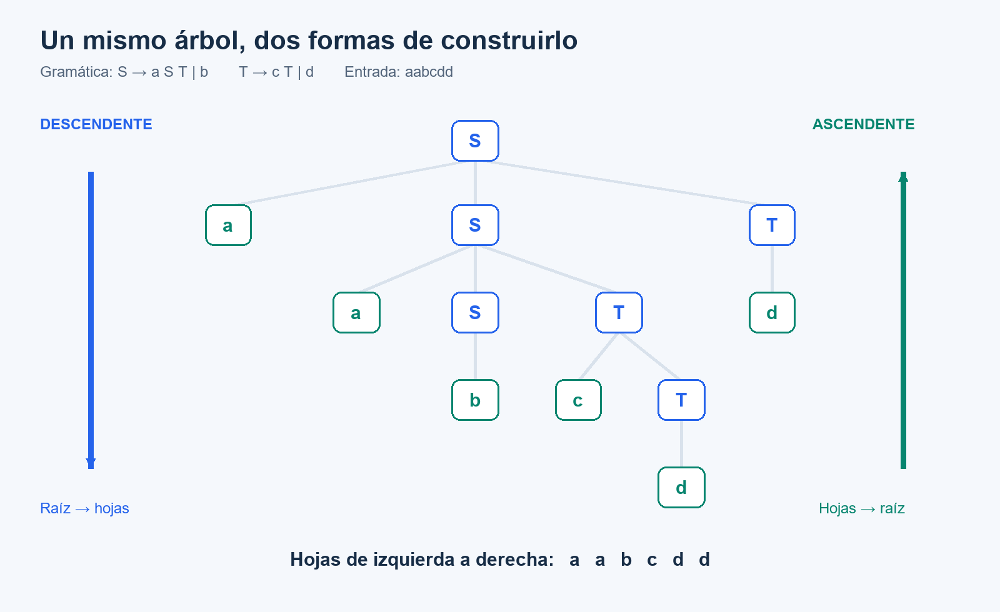
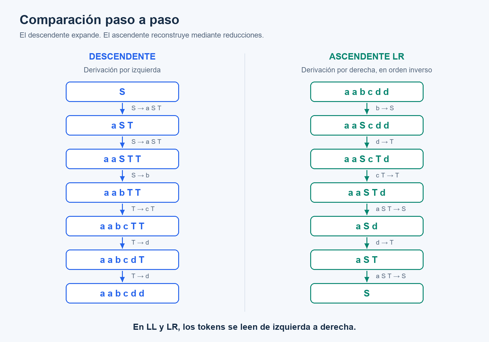
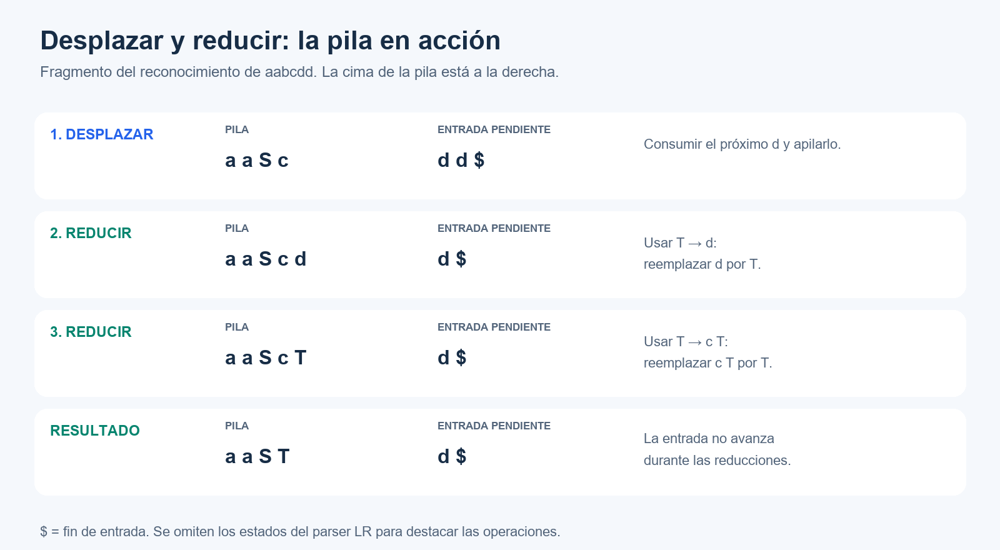
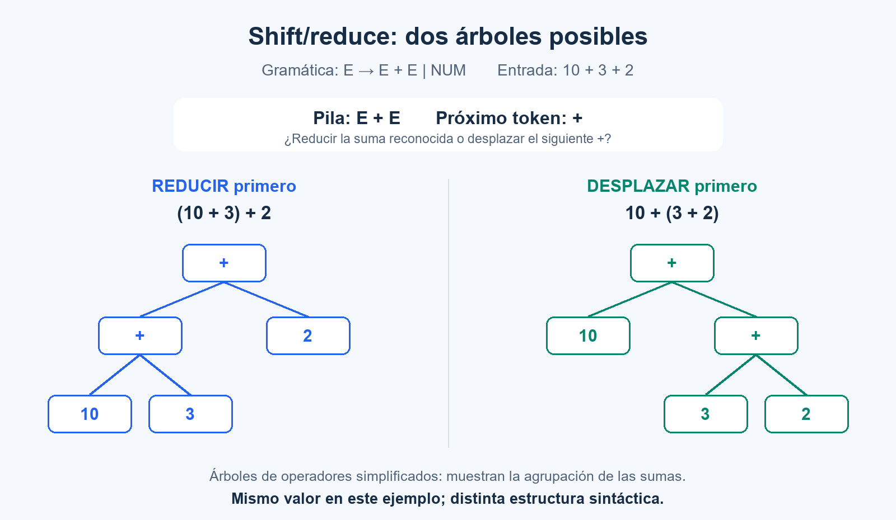

# Tipos de análisis sintácticos

**Sintaxis y Semántica de los Lenguajes**

## Del flujo de tokens a la estructura

El **analizador sintáctico**, también llamado *parser*, recibe los tokens del analizador léxico y reconoce cómo se organizan según una gramática.

Por ejemplo, para esta asignación:

```text
posición = inicial + velocidad * 60
```

El analizador léxico entrega una secuencia como:

```text
IDENTIF  '='  IDENTIF  '+'  IDENTIF  '*'  CONST
```

El parser reconoce la estructura de la asignación y de su expresión. Los lexemas y valores asociados conservan información como `posición`, `velocidad` y `60`.

**Tener tokens válidos no garantiza una construcción válida.** `posición = + * 60` puede contener tokens reconocibles, pero su combinación no respeta la gramática de una asignación.

La estructura se puede representar con un **árbol de derivación**:

- La raíz es el **axioma**.
- Los nodos internos son **no terminales**.
- Las hojas representan los **terminales**. Si hay producciones vacías, también puede dibujarse `ε`, que no es un token de entrada.

El árbol puede ser explícito o quedar implícito durante el reconocimiento. Comprobar tipos o declaraciones de variables requiere verificaciones adicionales.

## Dos enfoques: descendente y ascendente

| Aspecto | Descendente (*top-down*) | Ascendente (*bottom-up*) |
| --- | --- | --- |
| Parte conceptualmente de… | El axioma | Los tokens |
| Construye el árbol… | De la raíz hacia las hojas | De las hojas hacia la raíz |
| Operación característica | Expandir un no terminal | Reducir una secuencia a un no terminal |
| En LL/LR, se relaciona con… | Derivación por izquierda | Derivación por derecha en orden inverso |
| Ejemplo | Descenso recursivo predictivo | Parser LR de desplazamiento y reducción |

> **Descendente y ascendente indican cómo se construye el árbol. En LL y LR, la entrada se lee de izquierda a derecha en ambos casos.**

## Un mismo ejemplo para ambos enfoques

Consideremos esta gramática:

```text
(1) S → a S T
(2) S → b
(3) T → c T
(4) T → d
```

El axioma es `S`. Los no terminales son `S` y `T`; los terminales son `a`, `b`, `c` y `d`. Queremos reconocer la cadena **`aabcdd`**.



Al leer las hojas de izquierda a derecha obtenemos `a a b c d d`. El árbol muestra cómo esas hojas se agrupan mediante las producciones de la gramática.

## Análisis descendente: expandir desde el axioma

Se comienza en `S` y se aplican producciones hasta reconocer la entrada. En el recorrido LL se expande siempre el **no terminal pendiente más a la izquierda**.

Como la entrada comienza con `a`, elegimos `S → a S T`. La siguiente `a` vuelve a conducir a esa producción. Luego, `b` permite elegir `S → b`.

| Paso | Forma sentencial actual | Producción aplicada | Resultado |
| --- | --- | --- | --- |
| 1 | `S` | `S → a S T` | `a S T` |
| 2 | `a S T` | `S → a S T` | `a a S T T` |
| 3 | `a a S T T` | `S → b` | `a a b T T` |
| 4 | `a a b T T` | `T → c T`, sobre el primer `T` | `a a b c T T` |
| 5 | `a a b c T T` | `T → d`, sobre el primer `T` | `a a b c d T` |
| 6 | `a a b c d T` | `T → d` | `a a b c d d` |

La secuencia de producciones es **1, 1, 2, 3, 4, 4**.

Cuando aparece `a a b T T`, se expande primero el `T` de la izquierda. “Por izquierda” describe qué no terminal se expande, no desde qué lado se lee la cadena.

## Análisis ascendente: reducir hasta el axioma

El analizador agrupa partes reconocidas de la entrada. Una **reducción** reemplaza el lado derecho de una producción por su lado izquierdo.

Por ejemplo, usando la producción `S → b`, se puede reducir `b` a `S`. La producción de la gramática no cambia: se utiliza en sentido inverso para reconstruir la estructura.

### ¿Por qué la primera reducción ocurre en `b`?

El parser **empieza leyendo la primera `a`**, no salta directamente a `b`. Las primeras dos `a` todavía no permiten completar ninguna producción: la regla `S → a S T` requiere reconocer también un `S` y un `T`.

Al llegar a `b`, el parser encuentra el lado derecho completo de `S → b` y puede realizar la primera reducción:

| Acción | Pila de símbolos | Entrada pendiente |
| --- | --- | --- |
| Inicio | Vacía | `a a b c d d $` |
| Desplazar la primera `a` | `a` | `a b c d d $` |
| Desplazar la segunda `a` | `a a` | `b c d d $` |
| Desplazar `b` | `a a b` | `c d d $` |
| Reducir `b` a `S` | `a a S` | `c d d $` |

La cima de la pila está a la derecha y `$` indica fin de entrada. **Desplazar** consume y apila un token; **reducir** agrupa símbolos ya reconocidos sin consumir otro token.

> **Empieza a leer por `a`, pero la primera reducción ocurre en `b`.** Una tabla que muestra solamente las reducciones omite los desplazamientos intermedios.

En el árbol, esa primera reducción crea un nodo `S` cuyo hijo es `b`. Las dos `a` quedan pendientes para agrupaciones posteriores. Cada nueva reducción crea un padre y conserva los subárboles ya construidos.

En este ejemplo, la reducción es válida en ese contexto. En general, un parser LR decide mediante sus estados y tablas: no alcanza con encontrar cualquier fragmento que coincida con el lado derecho de una producción.

### ¿Por qué “derivación por derecha en orden inverso”?

Primero derivamos la cadena expandiendo siempre el no terminal más a la derecha:

```text
S
⇒ a S T          (1)
⇒ a S d          (4)
⇒ a a S T d      (1)
⇒ a a S c T d    (3)
⇒ a a S c d d    (4)
⇒ a a b c d d    (2)
```

Esta derivación también parte del axioma. El análisis ascendente LR **reconstruye sus pasos en orden inverso**:

| Paso | Forma actual | Reducción | Resultado |
| --- | --- | --- | --- |
| 1 | `a a b c d d` | `b → S` | `a a S c d d` |
| 2 | `a a S c d d` | Primer `d → T` | `a a S c T d` |
| 3 | `a a S c T d` | `c T → T` | `a a S T d` |
| 4 | `a a S T d` | `a S T → S`, desde la segunda `a` | `a S d` |
| 5 | `a S d` | `d → T` | `a S T` |
| 6 | `a S T` | `a S T → S` | `S` |

El orden de las producciones reconocidas es **2, 4, 3, 1, 4, 1**: el inverso de la derivación por derecha anterior.



**Atención:** las reducciones del ascendente LR invierten una derivación por **derecha**, no la derivación por izquierda del ejemplo descendente.

### Desplazamiento y reducción (*shift/reduce*)

Un parser LR combina estas operaciones:

- **Desplazar:** consumir el próximo token y apilarlo.
- **Reducir:** reemplazar el lado derecho de una producción en la cima de la pila por su no terminal izquierdo.

El siguiente fragmento muestra qué ocurre después de reconocer `a a S c`:



La traza continúa reduciendo `a S T` a `S`, desplazando el último `d` y realizando las reducciones restantes hasta aceptar.

Un parser LR real utiliza **estados y tablas** para decidir qué acción corresponde. No reduce cualquier fragmento que coincida con una producción: la reducción debe ser válida en ese contexto. Las imágenes omiten los estados para destacar la idea.

## ¿Dónde entra Bison?

**Bison utiliza el enfoque ascendente.** A partir de una gramática y acciones asociadas, genera el mecanismo que decide los desplazamientos y las reducciones. Las acciones semánticas ubicadas al final de las reglas se ejecutan al reducirlas.

Su configuración predeterminada utiliza tablas **LALR(1)**. También permite generar analizadores con otras tablas LR y analizadores GLR. [Manual oficial de GNU Bison](https://www.gnu.org/s/bison/manual/bison.html).

| Descenso recursivo predictivo | Parser LR generado con Bison |
| --- | --- |
| Resulta accesible para implementar y depurar a mano. | Automatiza decisiones que sería trabajoso construir a mano. |
| Necesita una gramática apropiada para elegir las alternativas. | Admite recursividad por izquierda y muchas gramáticas que no son LL(1). |
| Permite diseñar mensajes de error contextualizados. | También permite configurar diagnósticos y recuperación de errores. |

Ningún enfoque garantiza por sí solo mejores mensajes, mayor velocidad o menor consumo de memoria: esas propiedades dependen de la implementación y de la gramática.

### Ambigüedad y precedencia

Un parser ascendente **no elimina automáticamente las ambigüedades**. Por ejemplo:

```text
E → E + E | E * E | identif | const
```

Esta gramática permite más de un árbol para `inicial + velocidad * 60`. Para establecer la prioridad de `*` sobre `+` es necesario estructurar la gramática o agregar reglas de precedencia y asociatividad.

## Conflictos y errores en Bison

**Shift y reduce no son errores:** son las operaciones normales del parser. Un conflicto aparece cuando, para un mismo estado y token de preanálisis, la construcción de las tablas propone más de una acción.

| Situación | ¿Qué ocurre? | ¿Cuándo se detecta? |
| --- | --- | --- |
| **Shift** | Se consume y apila el próximo token. | Durante el análisis de la entrada. |
| **Reduce** | Se agrupan símbolos mediante una producción. | Durante el análisis de la entrada. |
| **Conflicto shift/reduce** | Hay una posibilidad de desplazar y otra de reducir. | Al generar el parser con Bison. |
| **Conflicto reduce/reduce** | Hay dos o más reducciones posibles. | Al generar el parser con Bison. |
| **Error sintáctico** | La entrada no permite continuar según las acciones válidas del parser. | Al analizar una entrada concreta. |

### 1. Shift/reduce: ¿cierro la suma o sigo leyendo?

Consideremos una gramática que permite sumas pero no establece cómo agruparlas:

```text
E → E + E | NUM
```

Para `10 + 3 + 2`, después de reconocer `10 + 3` tenemos esta situación conceptual:

```text
Pila:                E + E
Próximo token:       +
Entrada pendiente:   + NUM $
```

Hay dos posibilidades:

- **Reducir `E + E` a `E`:** cerrar primero `10 + 3`. La agrupación resultante es `(10 + 3) + 2`.
- **Desplazar `+`:** continuar la expresión de la derecha. La agrupación resultante es `10 + (3 + 2)`.



Aunque estas sumas dan el mismo resultado aritmético, **los árboles son distintos**. Con una resta, la diferencia también afectaría al valor: `(10 - 3) - 2 = 5`, mientras que `10 - (3 - 2) = 9`.

Este archivo mínimo permite explorar el conflicto al generar las tablas:

```bison
/* suma.y */
%token NUM
%start expresion
%%
expresion: expresion '+' expresion | NUM ;
%%
```

Bison puede informar una advertencia de tipo `shift/reduce conflict`. En un parser determinista, si no hay reglas de precedencia aplicables, **por defecto elige desplazar**. Esa decisión no garantiza la agrupación que queremos para el lenguaje. [Manual: conflictos shift/reduce](https://www.gnu.org/software/bison/manual/html_node/Shift_002fReduce.html).

**Una solución:** declarar la suma asociativa por izquierda, agregando esta línea antes del primer `%%`:

```bison
%left '+'
```

Así, en este conflicto se elige reducir, para obtener `(10 + 3) + 2`. Si además incorporamos una producción para multiplicación, podemos declarar:

```bison
%left '+'
%left '*'
```

Las declaraciones posteriores tienen mayor precedencia: `*` queda por encima de `+`. Otra solución es reestructurar la gramática para expresar directamente la precedencia y la asociatividad. [Manual: precedencia](https://www.gnu.org/software/bison/manual/html_node/Precedence-Examples.html).

### 2. Reduce/reduce: ¿a qué no terminal pertenece este token?

Ahora supongamos esta gramática:

```text
elemento → variable | funcion
variable → ID
funcion  → ID
```

Ante un único `ID` seguido del fin de entrada, hay dos reducciones posibles:

```text
                ID reconocido
                /           \
        reducir a           reducir a
         variable            funcion
             |                  |
         elemento            elemento
```

La entrada puede derivarse de dos maneras:

```text
elemento ⇒ variable ⇒ ID
elemento ⇒ funcion  ⇒ ID
```

El conflicto no consiste en decidir si leer otro token: **hay dos reglas distintas para reducir lo que ya se reconoció**.

```bison
/* identificador.y */
%token ID
%start elemento
%%
elemento: variable | funcion ;
variable: ID ;
funcion: ID ;
%%
```

Bison puede informar una advertencia de tipo `reduce/reduce conflict`. En un parser determinista, por defecto elige la regla que aparece primero. **Cambiar el orden de las reglas no corrige la gramática:** puede cambiar qué acciones semánticas se ejecutan. [Manual: conflictos reduce/reduce](https://www.gnu.org/software/bison/manual/html_node/Reduce_002fReduce.html).

**Una solución depende de qué queramos reconocer.** Si el segundo caso representa una llamada sin argumentos, podemos darle una estructura diferente:

```bison
elemento: variable | llamada ;
variable: ID ;
llamada: ID '(' ')' ;
```

Ahora `ID` y `ID '(' ')'` son construcciones diferentes. Si ambos casos deben ser solamente `ID`, conviene reconocer una única categoría sintáctica y resolver la distinción semántica con información adicional, por ejemplo la tabla de símbolos.

### 3. Error sintáctico: la entrada no encaja

Con la gramática de sumas, esta entrada es incorrecta:

```text
10 + + 3
```

Después del primer `+` se necesita otra expresión, que en esta gramática debe comenzar con `NUM`. El segundo `+` no permite continuar y se produce un error sintáctico.

Esto puede ocurrir incluso con un parser **sin conflictos**: la gramática puede estar bien definida y el texto de entrada estar mal escrito. El detalle del mensaje depende de cómo se configure el diagnóstico.

### Cómo investigar un conflicto

Para generar las tablas, el informe de estados y los contraejemplos:

```sh
bison -Wall -Wcounterexamples -v suma.y
bison -Wall -Wcounterexamples -v identificador.y
```

Los archivos de ejemplo anteriores sirven para generar e inspeccionar el parser; para compilar un ejecutable completo faltan el analizador léxico y las funciones de integración, como `yyerror`.

El archivo `.output` permite revisar el estado conflictivo; los contraejemplos ayudan a entender las decisiones en disputa. No basta con ocultar la advertencia: hay que decidir qué estructura debe reconocer el lenguaje. [Manual: contraejemplos](https://www.gnu.org/software/bison/manual/html_node/Counterexamples.html).

En estos dos ejemplos, las gramáticas son ambiguas. **No todo conflicto de Bison demuestra por sí solo ambigüedad:** algunos pueden deberse a las limitaciones del método de construcción de tablas elegido.

> **Shift/reduce: “¿desplazo o reduzco?”. Reduce/reduce: “¿con cuál regla reduzco?”. Error sintáctico: “esta entrada no permite continuar”.**